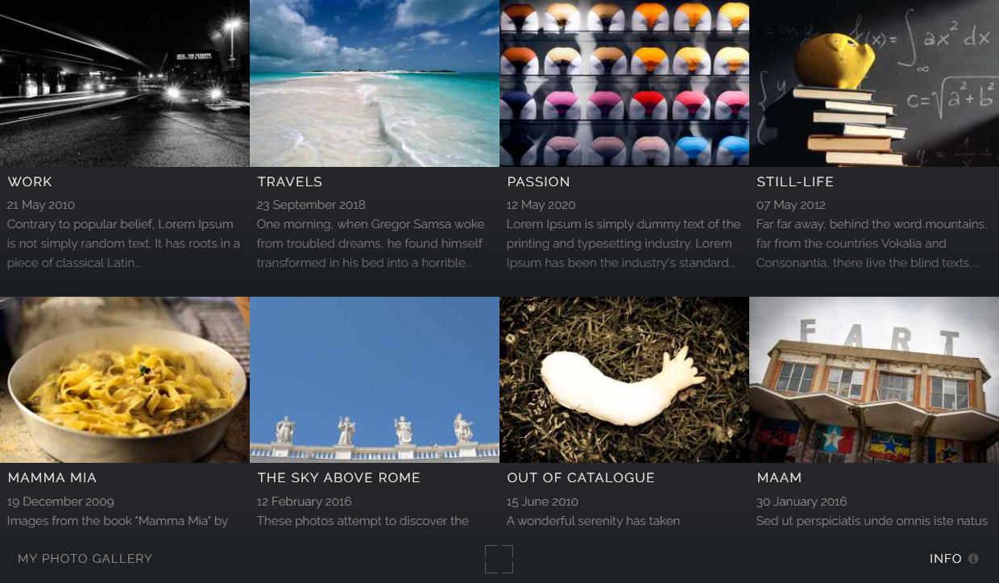

# Multiverse

## A responsive theme for [Zenphoto](https://www.zenphoto.org/)

This theme was initially developed for use on my own website, as a single album theme, just for some special presentations. Later I've added support for a complete gallery and for Zenpage extension too, so it can now also be used as the main theme of a Zenphoto gallery or a Zenphoto/Zenpage CMS*. It has been adapted for Zenphoto and extended to a multi-page theme from HTML5 UP’s [Multiverse](https://html5up.net/multiverse), a single-page web gallery, with some new JavaScript functionality as well:

* Touch swipe on the popup for navigation between images
* Preload of two images (prev & next)
* Zoom on double tap (or double click) and pan image
* Slide show
* Full screen button
* Some Zenphoto layout remodeling
* Zenphoto ajax contact form

~~Following the original nature of Multiverse layout, I have not included a real single image page. The `image.php` file is actually just a redirect script that acts to open the image popup in its album page.~~

A regular `image.php` page has been added since v2.0.

\*Currently, **only image objects** are supported in albums, so Multiverse is not yet suitable for a full multimedia gallery. I may add support for medias other than images sooner or later, but I can't really say if and when. However, videos and other medias can of course be embedded in pages and news articles, like every other Zenpage theme allows to do.

A short video showing some theme features is available [here](https://www.antonioranesi.it/pages/multiverse-zenphoto-theme#demo-video). 

### Installation

1. Download latest release and extract the content.
2. Find the `multiverse` folder and use an ftp client to upload exclusively it into `themes` folder of your ZP installation.
3. Visit Multiverse option page in your admin area.
4. Activate Multiverse to use it as the main theme of your gallery or assign it to any album you wish.

### Translations

Multiverse is translatable by configuring a [Poedit](https://poedit.net/) catalogue with the keywords `gettext_th`, `ngettext_th:1,2`. If you wish to provide a translation other than Italian, which is already available, be sure to uncheck the box _Also use default keywords for supported languages_ in your catalogue properties, so that you don’t have to translate strings already managed by Zenphoto translators, but just a few theme defined strings.

### Credits

This theme is based on Multiverse by HTML5 UP, a program licensed under the [Creative Commons Attribution 3.0 License](https://creativecommons.org/licenses/by/3.0/), Copyright (c) [@ajlkn](https://twitter.com/ajlkn). All JavaScript and CSS files from the original package have been included unchanged (but minified and merged) in this software, except for `main.js` and `style.css` files, which have also been edited to adapt them to Zenphoto design and add some JavaScript functionalities and some CSS rules.

To run touch events, Matt Brison’s [TouchSwipe](https://github.com/mattbryson/TouchSwipe-Jquery-Plugin) Jquery Plugin has been included. It is dual licensed under the MIT or GPL-2 licenses.

Multiverse also includes [Font Awesome](https://fontawesome.com/v4.7.0/) by Dave Gandy.

### Changelog
After v1.2 a [changelog](CHANGELOG.md) updated even with still unreleased major changes has been added.
